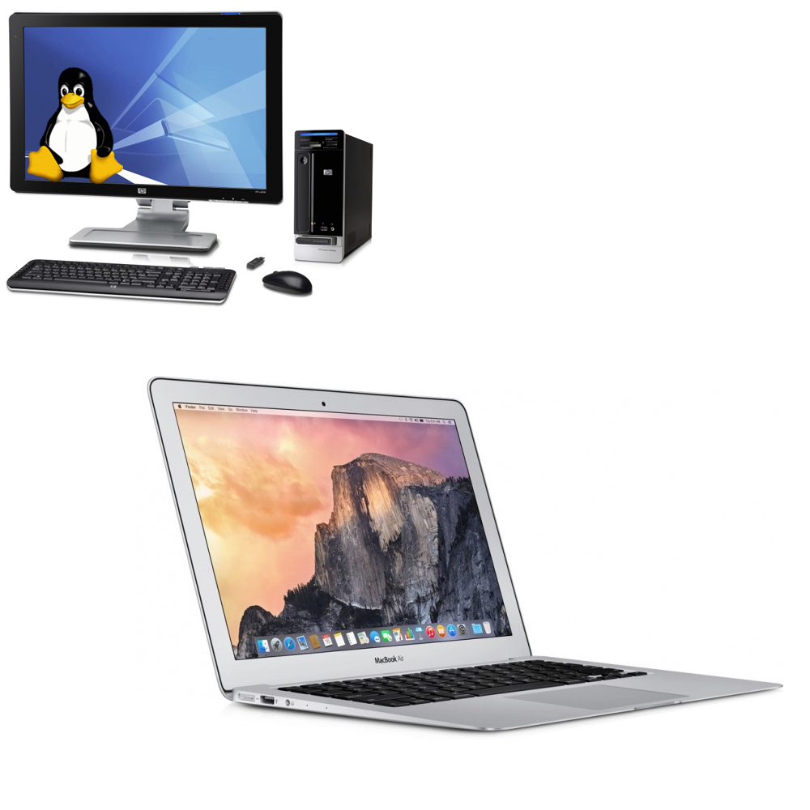

#  Computer

Automated experiment rig may or may not already contain one.

Researcher probably has one and might use it to communicate with rig.

Easy to write software using high-level programming languages.

Might get tricky to support all operating systems, programming language choices,
and soundcard device drivers.

Sound output may accidentally be disabled or overridden by the user clicking on
a web page, plugging in head phones, playing a movie, or updating software.

Timing may be affected by other operating system processes, like synchronizing
dropbox, automatic updates, saving or processing giant files, or going to sleep.

Might need to add extra hardware to get input and output pins.

