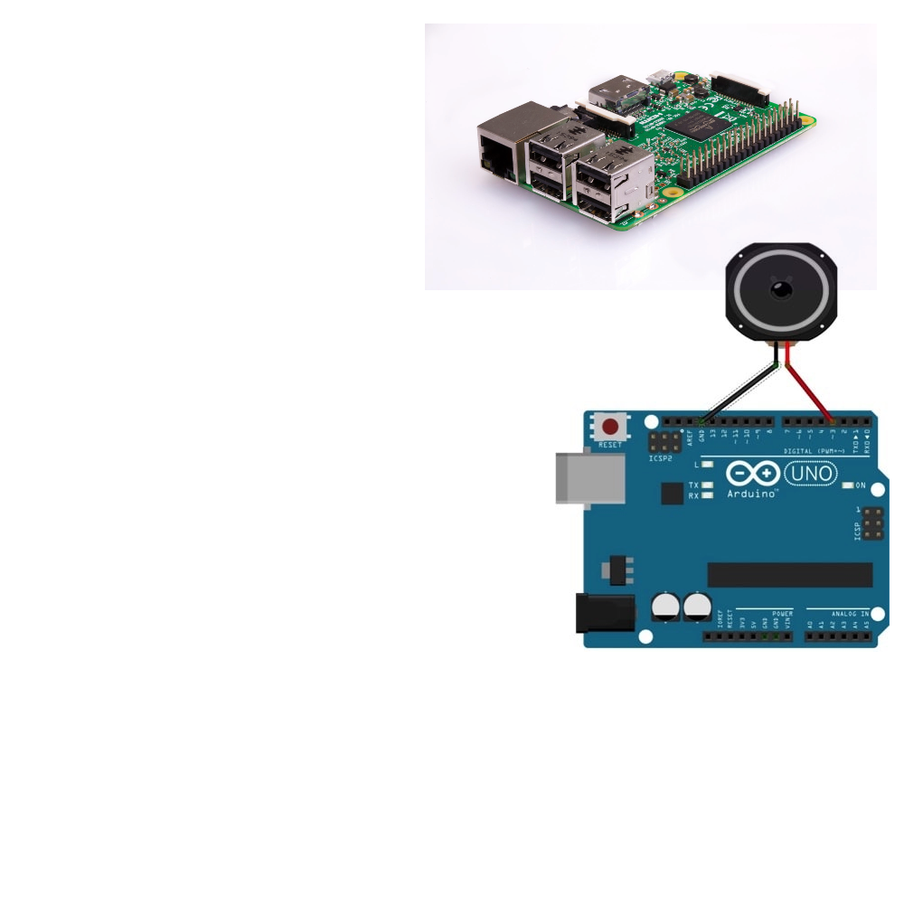

#  Dedicated Processor

Processors are inexpensive.

Easier to standardize on multiple rigs.

Easier to control the software and hardware environment.

Performance is not affected by user's computer.

Can be used standalone or as a connected device.

